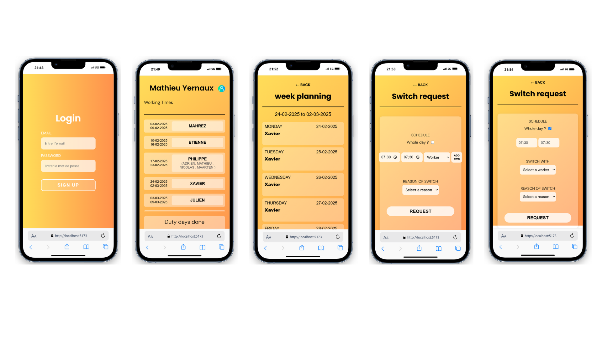

# ⚡ Elia - Shift & Absence Management System

## 📸 Demo
<p align="center">
  
</p>

---

## 📖 About the Project
**eDuty** is a prototype application developed for **Elia**, the Belgian electricity 
transmission system operator. The company needed a solution to **digitally manage employee schedules**, 
replacing the manual work of the secretary responsible for handling **shift replacements, absences, and schedule changes** 
due to vacations, emergencies, or errors.

Our application centralizes **all scheduling modifications**, allowing employees to **declare absences**, 
ensure **replacement validation**, and streamline **schedule adjustments** efficiently.

🚀 **Project Status**: Currently in prototype phase, presented to the company.

---

## 🔧 Technologies Used
### **Backend**:
- **Node.js & Express.js** - Server-side logic
- **MongoDB & Mongoose** - NoSQL database for schedule management
- **JWT & Bcrypt** - Secure authentication and user management
- **Middleware & Role-Based Access Control (RBAC)** - Ensuring secure and controlled access
- **Render** - Backend deployment (not fully completed)

### **Frontend**:
- **React.js (Vite.js)** - Fast development and optimized UI
- **React Router** - Navigation between views
- **Axios** - API communication
- **Tailwind CSS** - UI styling and responsiveness

---

## 🚀 Features
✅ **Employee Self-Service**: Employees can declare absences and propose replacements.  
✅ **Schedule Modification**: Managers can approve or reject schedule changes.  
✅ **User Authentication**: Secure login system using **JWT authentication**.  
✅ **Admin & User Roles**: Different access levels for employees and administrators.  
✅ **Error & Conflict Management**: Prevents overlapping schedules or double bookings.  
✅ **Centralized Database**: All modifications are stored in **MongoDB**, ensuring accurate tracking.  

---

## 📂 Project Structure


```bash
Elia-Project/
│── ClientElia/       # Frontend - React (Vite.js)
│   ├── src/
│   │   ├── components/  # UI Components (Login, etc.)
│   │   ├── pages/       # Page views (Dashboard, Forms)
│   │   ├── App.jsx      # Main React App
│   │   ├── index.jsx    # Entry point
│   ├── public/         # Static assets
│   ├── package.json    # Frontend dependencies
│── server/            # Backend - Node.js & Express
│   ├── config/        # Database & Environment Config
│   ├── controllers/   # API Logic
│   ├── middlewares/   # Authentication & Security
│   ├── models/        # MongoDB Schemas
│   ├── routes/        # API Endpoints
│   ├── index.js       # Server Entry Point
│── .env               # Environment Variables
│── README.md          # Documentation
```

---

## 🚀 Installation & Setup
### **1️⃣ Clone the Repository**
```sh
https://github.com/Nkapj/Elia-Project.git
cd elia
```
---

## 🔮 Future Improvements
🔹 **Complete Deployment**: Successfully deploy backend & frontend.  
🔹 **Notifications**: Add email/SMS notifications for schedule changes.  
🔹 **Admin Dashboard**: Improve manager/admin interface.  
🔹 **User Experience (UX)**: Enhance UI for better usability.  

---

## 👥 Contributors
| Name | Role |
|----------------|------------------------------|
| **[Jessica Nzi](https://github.com/Nkapj)** | Backend Development & Database Management |
| **[Timmy Truong](https://github.com/titruong99)** | Backend-Frontend API Integration |
| **[Chloé Hamoir](https://github.com/littlefoxy1nk)** | Frontend UI Development |

---

📌 **Elia** aims to streamline scheduling, reduce administrative workload, and improve employee autonomy. This prototype serves as a strong foundation for a fully operational solution. 🚀
